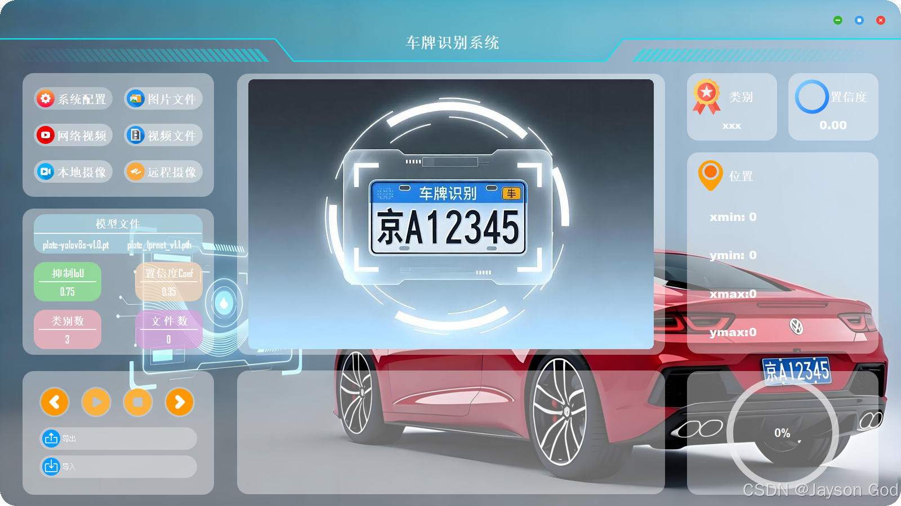
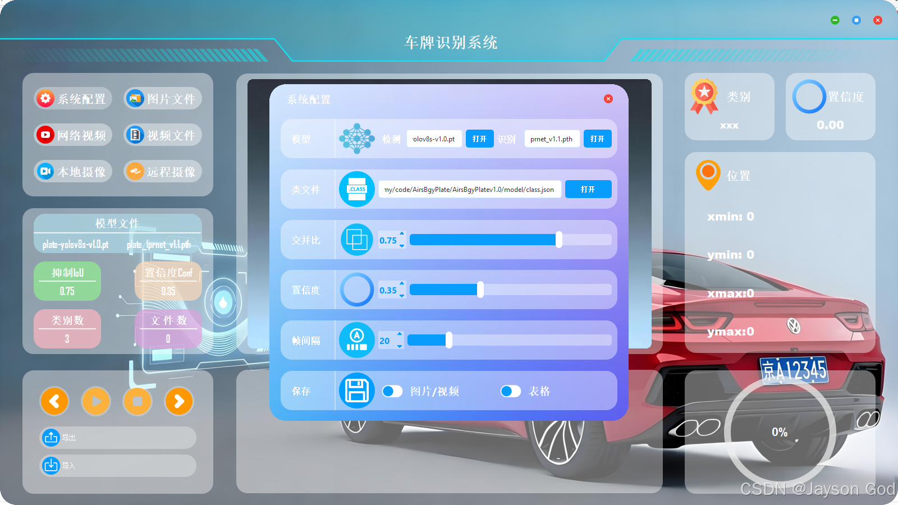
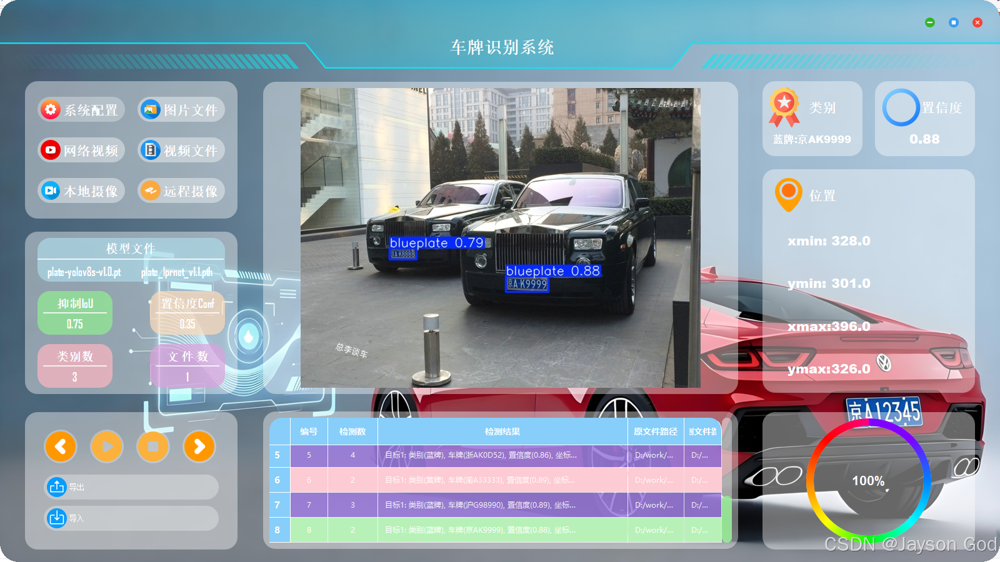
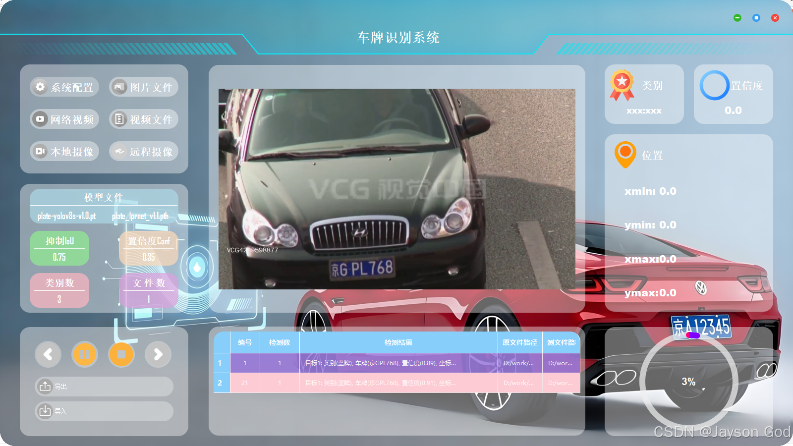
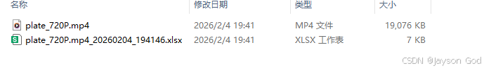
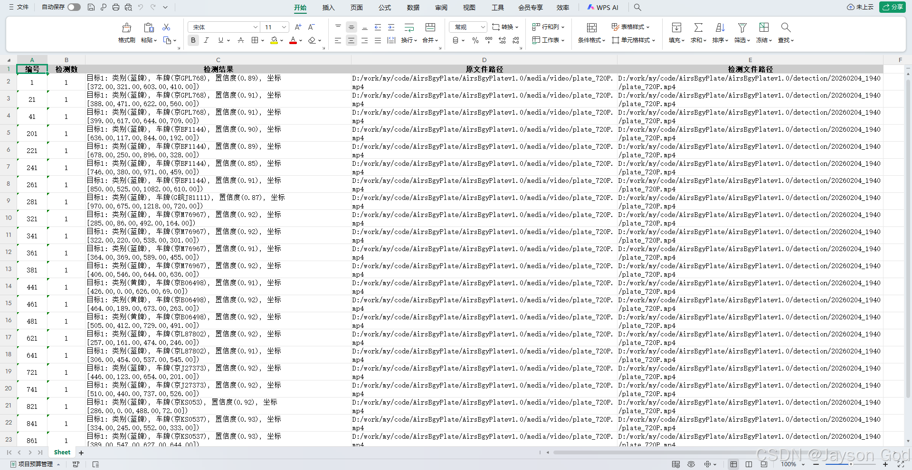
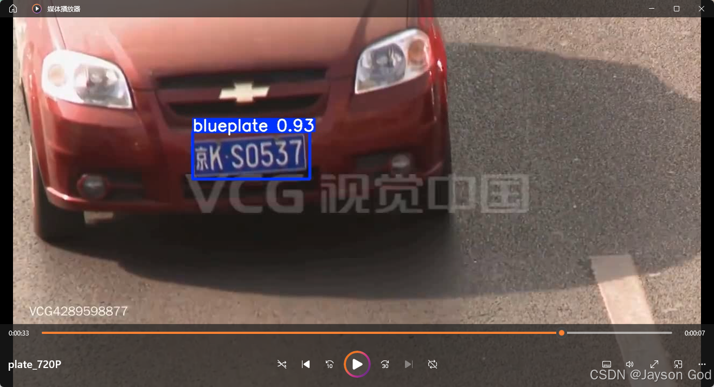

# 基于YOLO检测与LPRNet或OCR车牌识别系统

## 简介
&emsp;&emsp;本项目是一个功能完整、界面友好的车牌识别（License Plate Recognition, LPR）软件，采用 Python 开发，融合了深度学习与图形界面技术，适用于图像、视频、摄像头及网络流等多种输入场景。\
&emsp;&emsp;系统核心亮点在于同时支持两种主流 OCR 模型——专为中文车牌优化的 LPRNet 与通用性强、精度高的 CRNN，用户可在运行时自由切换，灵活应对不同环境下的识别需求。所有模型均支持 PyTorch 原生格式（.pth） 与高性能推理格式 ONNX，兼顾开发便利性与部署效率。\
&emsp;&emsp;前端界面基于 PyQt5 构建，提供直观的操作面板：支持图片/视频文件加载、实时摄像头预览、RTSP 网络流接入，并能动态展示识别结果、置信度、IOU 等关键信息。同时，软件内置配置管理模块，可保存用户偏好设置（如模型路径、识别阈值等），提升使用体验。\
&emsp;&emsp;该项目代码结构清晰、模块解耦良好，既可作为智能交通、安防监控等领域的原型系统，也适合作为计算机视觉与 PyQt 应用开发的学习范例。无论是研究人员、开发者还是技术爱好者，都能从中快速上手并进行二次开发。

## 软件界面
### 主界面

### 设置界面

## 软件功能
功能1：支持多种输入源，包括本地摄像头、图片文件、视频文件及网络视频流（如HTTP/RTSP）\
功能2：支持实时车牌检测和识别，在视频流中动态框出车牌(黄、绿、蓝)目标并显示置信度\
功能3：支持可视化交互界面，基于 PyQt5 开发，操作简洁、信息清晰\
功能4：支持自定义检测参数，如置信度阈值、NMS IoU 阈值等，灵活调整识别灵敏度\
功能5：支持检测结果导入/导出，可保存带标注框的图像或视频用于回溯分析\
功能6：支持模型热替换与再训练，用户可加载自定义数据集重新训练并部署新模型\
功能7：支持鼠标在显示画面悬停切换展示目标框信息。

## 图片检测

## 视频检测

## 软件详细功能请看文章
https://blog.csdn.net/u011425939/article/details/157733147
